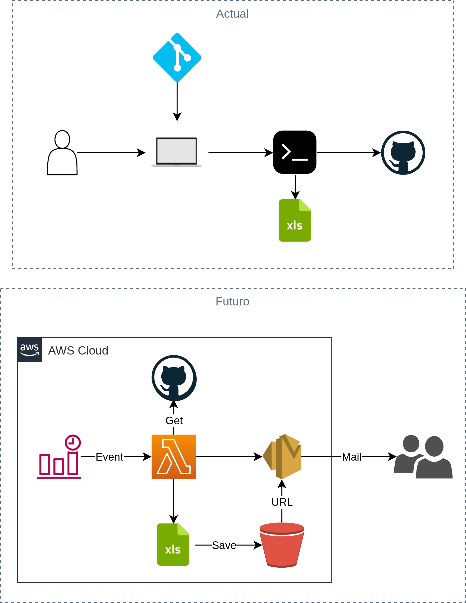

## **Arquitectura**

<p align="center">
  
</p>

## **Prerrequisitos**

* [Linux OS](https://www.linux.org)
* [GitHub Token](https://docs.github.com/es/authentication/keeping-your-account-and-data-secure/creating-a-personal-access-token)

## **Variables**

| Name | Description | Type | Default | Required |
|------|-------------|------|---------|----------|
| `GITHUB_TOKEN` | Token de acceso | string | | yes |

## **Uso**

1. Crear reporte de Pull Request:

```bash
make pr
```

Archivo de salida: pullrequest.xls

2. Crear reporte de Checks Status:

```bash
make checks
```

Archivo de salida: checks.xls

3. Crear reporte de inventario de repositorios:

```bash
make inventory
```

Archivo de salida: inventory.xls